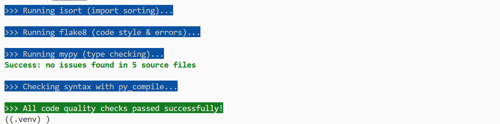
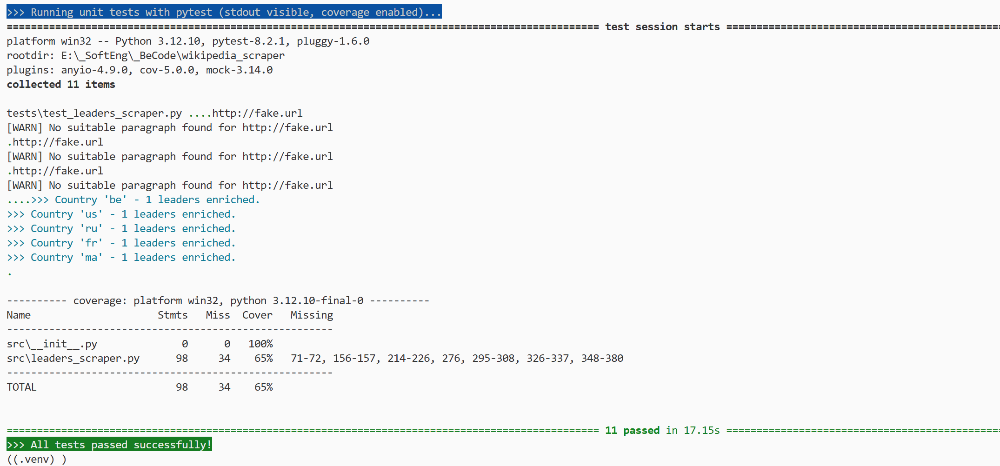

# Wikipedia Scraper 


This project demonstrates how to collect structured and semi-structured data from an open API and enrich it with data scraped from Wikipedia.

You will retrieve historical political leaders for several countries using a REST API, then scrape their biographies using BeautifulSoup. Finally, the data is saved locally for further use in data science workflows.


## Prerequisites

Make sure you have **Python 3.12.10** installed.

- Download from: https://www.python.org/downloads/release/python-31210/
- Add Python to the system PATH.

>  This project was tested with Python 3.12.10. Other versions may cause compatibility issues (e.g., with pandas or ipykernel).


## Environment Setup

This project uses a virtual environment (`.venv`) to isolate its dependencies.

### Why use a virtual environment?

- Prevents conflicts between Python packages
- Ensures consistency across machines
- Keeps the system Python clean

### Setup Instructions

Run the following commands in a Bash-compatible terminal (e.g., Git Bash):

```bash
chmod +x setup-env.sh
./setup-env.sh
```

## Running the Application

You can run the project either via **Jupyter Notebook** or as a **standalone script**.

### Run in Notebook Mode

1. Open `wikipedia_scraper.ipynb` in **VS Code**
2. Select the `.venv` kernel
3. Run each cell step by step


### Run in Script Mode (recommended)

This mode uses `main.py` to launch the full scraping pipeline.

```bash
chmod +x run-main.sh
./run-main.sh
```
## Technologies Used

- **Python 3.12.10**  
  The main programming language used for building the entire scraping pipeline.

- **`requests`**  
  For sending HTTP requests to APIs and web pages to retrieve data.

- **`beautifulsoup4`**  
  Used for parsing and navigating HTML content from Wikipedia pages.

- **`pandas`**  
  Powerful library for manipulating and organizing data into structured DataFrames.

- **`json`**  
  Native Python module to serialize and deserialize JSON data (used for saving final output).

- **`re` (regex)**  
  Python's built-in regular expressions module for text pattern matching and data cleaning.

- **`multiprocessing`** *(optional)*  
  For parallelizing API requests or processing multiple items simultaneously to improve performance.

## Generating Class Documentation

You can use the script `generate-docs.sh` to automatically generate HTML documentation for all classes using [pdoc](https://pdoc.dev).

This script will:

- Generate clean HTML documentation in the `docs-pdoc/` folder
- Open the folder in Windows File Explorer
- Launch your default web browser with the `index.html` page

> This is helpful for quickly reviewing the class structure, methods, and docstrings without diving into the source code.

### Usage

Run the following in a Bash-compatible terminal (e.g., Git Bash or VS Code terminal):

```bash
chmod +x generate-docs.sh
./generate-docs.sh
```

## Code Quality Checks
Before running or deploying the code, it's recommended to ensure it meets quality standards.  
This project includes an automated quality check script:

```bash
./check-quality.sh
```

### 1. Black – Code Formatting
Runs Black to automatically format Python code to a consistent style (PEP8-compliant).

```bash
black src/ tests/
```
- Ensures all files are properly indented and styled.
- Fixes common formatting issues automatically.

### 2. Isort – Import Sorting
Runs isort to clean and group Python import statements.

```bash
isort src/ tests/
```
- Sorts imports alphabetically.
- Separates standard library, third-party, and local imports.

### 3. Flake8 – Linting and PEP8 Compliance

Runs `flake8` to detect coding style violations and potential bugs.

```bash
flake8 src/ tests/
```
- Highlights unused variables, trailing spaces, line length violations, etc.
- Helps enforce consistent and clean code.

### 4. py_compile – Syntax Check

Checks for low-level syntax errors (without running the code).

```bash
find src/ tests/ -name "*.py" -exec python -m py_compile {} \;
```

- Ensures that all Python files are syntactically valid.

  

### 5. Pylance – Real-Time Static Analysis (VS Code)

If you use **Visual Studio Code**, it's strongly recommended to enable the **Pylance** extension for fast, real-time type checking and code intelligence.

- Provides IntelliSense, auto-imports, type inference, and error highlighting.
- Uses the [Pyright](https://github.com/microsoft/pyright) engine for static type checking.
- Works best when `pyrightconfig.json` or type hints (`.pyi` or `typing`) are correctly configured.

To install:
1. Go to the **Extensions Marketplace** in VS Code.
2. Search for `Pylance` and install it.
3. Set it as your language server (should be automatic).

```json
// In your VS Code settings.json
{
    // Use Pylance for enhanced language features (optional)
  "python.languageServer": "Pylance",
 
  // Set type checking mode to off, basic, strict (optional)
  "python.analysis.typeCheckingMode": "strict"  
}
```

## Unit Tests

Unit tests are located in the `tests/` directory and are written using `pytest`.

### Key Features
- Tests all core methods of the `WikipediaScraper` class  
- Uses `pytest-mock` to simulate API responses and Wikipedia page content  
- Measures code coverage using `pytest-cov`

### How to Run the Tests

Use the automated script:

```bash
chmod +x run-tests.sh
./run-tests.sh
```

  


## Branch Strategy

This repository is structured using two branches:
- `main`: Contains the required MVP with all mandatory features.
- `feature/advanced`: Contains nice-to-have additions such as `Session()`, regex text cleaning, and multithreading.

This approach ensures a clean separation between baseline functionality and performance/UX improvements.

## Feature Completion Table 


| Feature                                                                                                    | Required Type  | Implemented |
|------------------------------------------------------------------------------------------------------------|----------------|-------------|
| Create a virtual environment using `venv`                                                                  | Mandatory      | ✅ Yes       |
| Install required packages via `requirements.txt`                                                           | Mandatory      | ✅ Yes       |
| Call an external API using `requests`                                                                      | Mandatory      | ✅ Yes       |
| Handle cookies to access the API                                                                           | Mandatory      | ✅ Yes       |
| Retrieve list of countries via `/countries` endpoint                                                       | Mandatory      | ✅ Yes       |
| Retrieve list of leaders via `/leaders` endpoint                                                           | Mandatory      | ✅ Yes       |
| Retrieve and parse Wikipedia bio from `wikipedia_url`                                                      | Mandatory      | ✅ Yes       |
| Extract first paragraph using `BeautifulSoup`                                                              | Mandatory      | ✅ Yes       |
| Save results in a structured JSON file                                                                     | Mandatory      | ✅ Yes       |
| Create a custom exception with proper handling                                                             | Mandatory      | ✅ Yes       |
| Provide a Jupyter notebook (`wikipedia_scraper.ipynb`) that shows the workflow                            | Mandatory      | ✅ Yes       |
| Refactor into a Python module `leaders_scraper.py` with OOP design (`WikipediaScraper` class)             | Mandatory      | ✅ Yes       |
| Provide a `main.py` script to run the scraper                                                              | Mandatory      | ✅ Yes       |
| Create a GitHub repository with meaningful name and clean folder structure                                 | Mandatory      | ✅ Yes       |
| Write a clear README with description, installation, usage, visuals, etc.                                  | Mandatory      | ✅ Yes       |

### WikipediaScraper Class Implementation

| Feature                                                                                                    | Required Type  | Implemented |
|------------------------------------------------------------------------------------------------------------|----------------|-------------|
| Attribute: `base_url`                                                                                      | Mandatory      | ✅ Yes       |
| Attribute: `country_endpoint`                                                                              | Mandatory      | ✅ Yes       |
| Attribute: `leaders_endpoint`                                                                              | Mandatory      | ✅ Yes       |
| Attribute: `cookies_endpoint`                                                                              | Mandatory      | ✅ Yes       |
| Attribute: `leaders_data`                                                                                  | Mandatory      | ✅ Yes       |
| Attribute: `cookie`                                                                                        | Mandatory      | ✅ Yes       |
| Method: `refresh_cookie()`                                                                                 | Mandatory      | ✅ Yes       |
| Method: `get_countries()`                                                                                  | Mandatory      | ✅ Yes       |
| Method: `get_leaders(country)`                                                                             | Mandatory      | ✅ Yes       |
| Method: `get_first_paragraph(wikipedia_url)`                                                               | Mandatory      | ✅ Yes       |
| Method: `to_json_file(filepath)`                                                                           | Mandatory      | ✅ Yes       |

### Nice-to-have / Advanced Features

| Feature                                                                                                    | Required Type  | Implemented  |
|------------------------------------------------------------------------------------------------------------|----------------|--------------|
| Use `requests.Session()` instead of `requests.get()`                                                       | Optional       | ✅ Yes       |
| Implement CSV export option                                                                                | Optional       | ✅ Yes       |
| Speed up scraping using multithreading (e.g. with `ThreadPoolExecutor`)                                    | Optional       | ✅ Yes       |
| Use regex to clean text data from Wikipedia                                                                | Optional       | ✅ Yes       |
| Organize must-have and nice-to-have code in separate Git branches (partially done, as the branching strategy was applied later in the process)           | Optional       | 🟡 Partially |
| Generate class documentation using `pdoc` via `generate-docs.sh`                                          | Optional       | ✅ Yes       |
| Run unit tests with `pytest` via `run-tests.sh` | Optional       | ✅ Yes       |


## License
This project is for educational purposes as part of the BeCode data science curriculum.